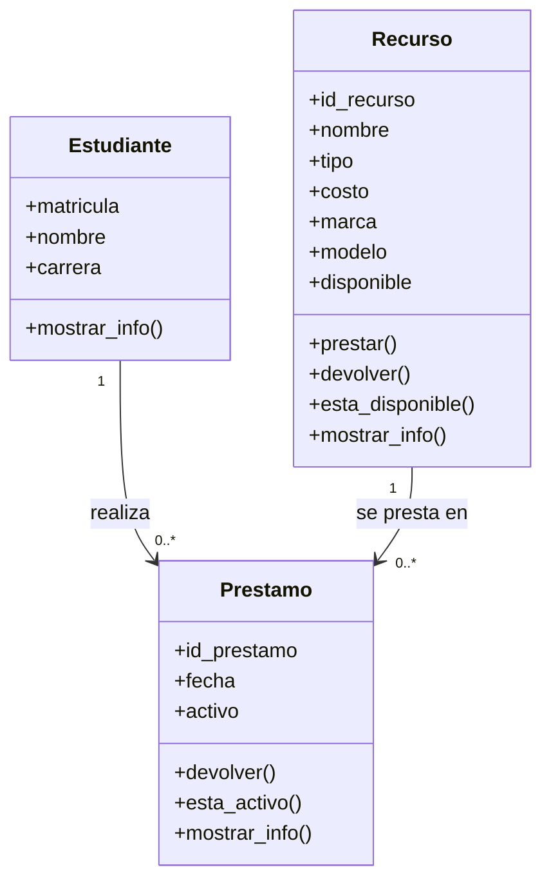

# Diagrama UML

```mermaid
classDiagram

class Recurso {
    +id_recurso
    +nombre
    +tipo
    +costo
    +marca
    +modelo
    +disponible
    +prestar()
    +devolver()
    +esta_disponible()
    +mostrar_info()
}

class Estudiante {
    +matricula
    +nombre
    +carrera
    +mostrar_info()
}

class Prestamo {
    +id_prestamo
    +fecha
    +activo
    +devolver()
    +esta_activo()
    +mostrar_info()
}

Estudiante "1" --> "0..*" Prestamo : realiza
Recurso "1" --> "0..*" Prestamo : se presta en
```
